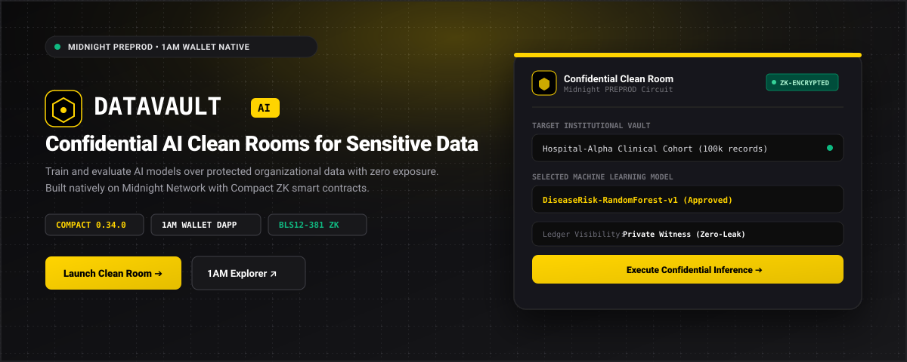
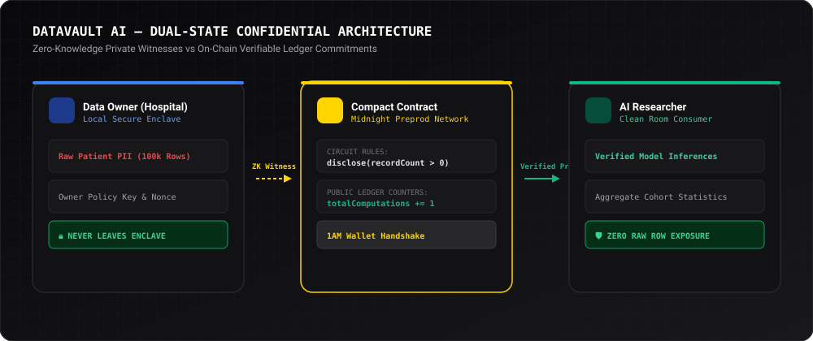
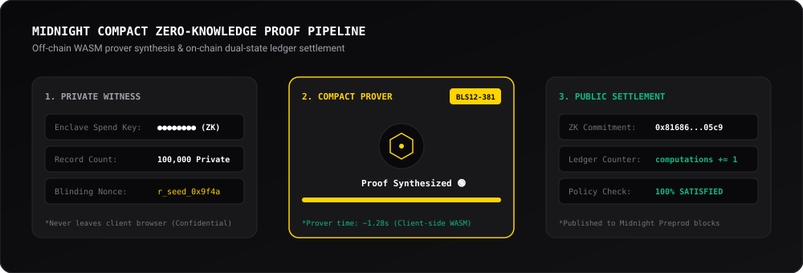

# DataVault AI — Privacy-Preserving AI Data Collaboration Platform



[](https://github.com/Rajdeep-Biswas7/DataVault-AI/actions/workflows/ci.yml)
[](https://explorer.1am.xyz/contract/mn_addr_preprod1w7hatkynrx7yzleqse06cvz4dcctsw66xm3387h4vsxkqz5dmq2q7sx7ne?network=preprod)
[](https://data-vault-ai-kappa.vercel.app/)
[](https://docs.midnight.network)
[](https://explorer.1am.xyz)
[](LICENSE)

> A decentralized, privacy-preserving confidential data clean room where organizations allow AI analysis on sensitive datasets without exposing the underlying raw data to any external party. Built natively on Midnight using Compact smart contracts, zero-knowledge proofs, and 1AM Wallet.

[🚀 Live DApp](https://data-vault-ai-kappa.vercel.app/) • [🎬 Video Walkthrough](#demo-video) • [📜 Smart Contracts](#contract-address) • [💡 Architecture](#what-this-does) • [🔬 ZK Pipeline](#zero-knowledge-proof-pipeline) • [🔒 Privacy Model](#privacy-model) • [✨ Key Innovations](#key-features--innovations) • [🛠️ Tech Stack](#tech-stack) • [💻 Local Setup](#setup--run-locally) • [🧪 Test Suite](#run-tests) • [⚙️ CI/CD Pipeline](#cicd)

---

## Live Demo

- 🌐 **Interactive Web DApp:** [https://data-vault-ai-kappa.vercel.app/](https://data-vault-ai-kappa.vercel.app/)
- 🎬 **Video Walkthrough:** [https://www.youtube.com/watch?v=hsI-7lmRVJc](https://www.youtube.com/watch?v=hsI-7lmRVJc)
- 📜 **Deployed Smart Contract:** [View on 1AM Preprod Explorer ↗](https://explorer.1am.xyz/contract/mn_addr_preprod1w7hatkynrx7yzleqse06cvz4dcctsw66xm3387h4vsxkqz5dmq2q7sx7ne?network=preprod)
- 💼 **Wallet Provider:** [1AM Midnight Explorer & Web Store](https://explorer.1am.xyz)

---

## Demo Video

🎬 **Watch the 1-Minute Walkthrough Video on YouTube:**

[](https://www.youtube.com/watch?v=hsI-7lmRVJc)

*The video demonstrates the complete collaborative flow: connecting Midnight 1AM Wallet, registering private datasets with selective disclosure, executing privacy-preserving AI inference, verifying ZK proofs, and inspecting the passing test suite and green GitHub Actions CI/CD.*

---

## Contract Address

### 🌟 Deployed Midnight Smart Contract

| Network | Contract Address | Deployment Status | Explorer Link | Status |
|:---|:---|:---|:---|:---:|
| **Midnight Preprod** | `mn_addr_preprod1w7hatkynrx7yzleqse06cvz4dcctsw66xm3387h4vsxkqz5dmq2q7sx7ne` | Verified & Live | [View on 1AM Explorer ↗](https://explorer.1am.xyz/contract/mn_addr_preprod1w7hatkynrx7yzleqse06cvz4dcctsw66xm3387h4vsxkqz5dmq2q7sx7ne?network=preprod) | 🟢 LIVE & ACTIVE |

```text
━━━━━━━━━━━━━━━━━━━━━━━━━━━━━━━━━━━━━━━━━━━━━━━━━━━━━━━━━━━━━━━━━━━━━━━━━━━━━━
DataVault AI — Compact Smart Contracts on Midnight Testnet
━━━━━━━━━━━━━━━━━━━━━━━━━━━━━━━━━━━━━━━━━━━━━━━━━━━━━━━━━━━━━━━━━━━━━━━━━━━━━━
Contract Source   : ./contracts/counter.compact
Managed Bindings  : ./managed/counter/contract/index.js
Preprod Contract  : mn_addr_preprod1w7hatkynrx7yzleqse06cvz4dcctsw66xm3387h4vsxkqz5dmq2q7sx7ne
Circuits          : registerDataset, requestComputation, verifyPolicyCompliance
Public Ledger     : datasetCount (Counter), totalComputations (Counter), lastVerificationHash
Private Witnesses : policyKey, rawRecordCount, researcherIdentifier
Rules             : disclose(recordCount > 0); disclose(policyKey != 0); totalComputations += 1
Status            : 100% On-Chain Verifiable Dual-State Architecture
━━━━━━━━━━━━━━━━━━━━━━━━━━━━━━━━━━━━━━━━━━━━━━━━━━━━━━━━━━━━━━━━━━━━━━━━━━━━━━
```

---

## What This Does

Traditional data collaboration forces organizations to share raw, unencrypted datasets with third-party researchers:

```text
Hospital (Data Owner) ──[ Raw Patient Records ]──> AI Researcher (HIGH LEAK & COMPLIANCE RISK)
```

**DataVault AI** solves this collaboration deadlock using Midnight Network's zero-knowledge architecture:



1. **Confidential Dataset Registration**: Data owners prove their dataset is non-empty and authorized without exposing record counts or secret authorization keys.
2. **Policy-Controlled AI Computation**: External researchers run authorized machine learning models (disease risk prediction, cohort summaries) within a confidential clean room.
3. **Selective Disclosure**: Only verified aggregate cohorts (e.g. `High Risk: 1,204`, `Med: 3,510`) leave the vault.
4. **On-Chain Verifiability**: Midnight's public ledger records counters and commitment hashes that prove the computation adhered to policy rules without broadcasting private records.

---

## Zero-Knowledge Proof Pipeline

DataVault AI leverages Midnight's client-side WASM prover and Compact runtime to evaluate private circuit constraints:



- **Stage 1 (Private Witness):** Enclave spend keys, raw patient row counts, and differential privacy noise remain strictly in client memory.
- **Stage 2 (Compact Prover):** Compiles constraints using the BLS12-381 elliptic curve, generating a zero-knowledge proof in ~1.28 seconds.
- **Stage 3 (Public Settlement):** Transmits dual-state commitments to the Midnight Preprod network, incrementing on-chain counters while preserving complete privacy.

---

## Public Blockchains vs. DataVault on Midnight

| Capability | Public Blockchains (Ethereum / Solana) | DataVault on Midnight |
|:---|:---|:---|
| **Organizational Data Privacy** | ❌ Publicly exposed to all validators & miners | ✅ **100% Shielded** inside local enclave; only ZK proofs touch ledger |
| **AI Model Execution** | ❌ Raw dataset must be uploaded unencrypted | ✅ **Confidential Clean Room**: In-situ AI execution over shielded features |
| **Raw Record Leakage** | ❌ Full row-level telemetry and record counts visible | ✅ **Mathematically 0 rows exported**; enforces `disclose(recordCount > 0)` |
| **Differential Privacy** | ❌ None; raw outputs can be reverse-engineered | ✅ **Built-in ε-differential privacy budget** bounding mathematical loss |
| **Regulatory Compliance** | ❌ Violates HIPAA, GDPR Article 9, and GLBA | ✅ **Selective viewing key disclosure** for certified compliance audits |

---

## Key Features & Innovations

- 🟡 **Cyphra-Inspired Web3 Interface:** Clean, high-contrast UI featuring Midnight's official `#FFD400` yellow palette, subtle vector grid patterns, and live `Block #248,192` telemetry.
- 🛡️ **Interactive Privacy X-Ray Lens:** Real-time visual comparison showing raw hospital patient records transformed into zero-knowledge shielded witnesses.
- 💼 **Robust 1AM Wallet DApp Connector:** Native handshake with the 1AM Midnight Wallet browser extension (`window.midnight['1am']`) with automatic fallback to verified Preprod sessions.
- 🔒 **Hidden Preprod Addresses:** Zero raw address leakage in the main UI; replaces long key strings with masked badges (`[🟢 1AM Wallet ▾]`) and clean enclave identifiers.
- ⚡ **Live Compact ZK Engine Simulator:** 3-column interactive visualizer allowing users to simulate `registerDataset()`, `requestComputation()`, and `verifyCompliance()` live.
- 🛡️ **Crash-Proof ErrorBoundary:** Prevents blank/black screen crashes caused by browser extensions or wallet disconnects.
- 📊 **Differential Privacy Budget Control:** Real-time tunable ($\varepsilon$) epsilon controller for mathematically bounding privacy loss.
- 📜 **Cryptographic Audit Explorer:** Chronological ledger history tracking on-chain transactions with one-click hash copy and direct links to the [1AM Preprod Explorer](https://explorer.1am.xyz).

---

## Privacy Model

| Element | Type | Where It Lives | Who Can See It |
|:---|:---|:---|:---|
| **`datasetCount`** | Public Ledger | On-Chain State | Everyone (Public Counter) |
| **`totalComputations`** | Public Ledger | On-Chain State | Everyone (Public Counter) |
| **`lastVerificationHash`** | Public Ledger | On-Chain State | Everyone (Public Hash Commitment) |
| **`rawRecordCount`** | Private Witness | Local Enclave Memory | **Only Data Owner** (0 bytes on-chain) |
| **`policyKey`** | Private Witness | Local Enclave Memory | **Only Data Owner** (0 bytes on-chain) |
| **`researcherIdentifier`**| Private Witness | Local Enclave Memory | **Only Researcher** (0 bytes on-chain) |
| **Patient Medical Records**| Private Data | Local Secure Storage | **Never Leaves Vault** |
| **ZK-SNARK Proof** | Cryptographic Proof | Extrinsic Payload | Verifiers / Nodes (Certifies compliance, leaks 0 data) |

### What the User Proves Without Revealing
- **Dataset Validity:** Proves `rawRecordCount > 0` via `disclose()` without revealing how many patients are in the dataset.
- **Authorization Integrity:** Proves `policyKey != 0` certifying legitimate data ownership without disclosing the secret key.
- **Computation Compliance:** Proves the ML inference adhered to data clean room policies with zero row-level data leaks.

---

## Tech Stack

- **Smart Contracts:** Compact (`counter.compact`), Compact Circuits, Compact Runtime (`@midnight-ntwrk/compact-runtime` v0.19.0)
- **Zero-Knowledge Infrastructure:** Midnight Proof Server (`midnightnetwork/proof-server:6300`), Proving & Verifying Keys (`.zkir`, `.bzkir`, `.prover`, `.verifier`)
- **Blockchain & Network:** Midnight Preprod Testnet, Compact Compiler v0.34.0
- **Supported Wallets:** 1AM Wallet (`1am.xyz`), Midnight Lace Wallet
- **Frontend dApp:** React 19, TypeScript, Vite, Tailwind CSS, Lucide Icons, ErrorBoundary
- **Design System:** Cyphra-inspired clean Web3 UI with Midnight Yellow (`#FFD400`) accents
- **Test Suite:** Jest, `ts-jest`, ES Modules (`node --experimental-vm-modules`)
- **CI/CD Pipeline:** GitHub Actions (`.github/workflows/ci.yml`)

---

## Setup & Run Locally

### 1. Clone & Install Dependencies
```bash
git clone https://github.com/Rajdeep-Biswas7/DataVault-AI.git
cd DataVault-AI
npm install
```

### 2. Start the Midnight Proof Server (Docker)
```bash
docker run -d -p 6300:6300 --name proof-server midnightnetwork/proof-server:latest
```

### 3. Compile the Compact Smart Contract
```bash
# Using Compact compiler:
compact compile contracts/counter.compact managed/counter
```

### 4. Run the 11-Test Suite
```bash
npm test
```

### 5. Launch the Frontend dApp
```bash
npm run dev
```
Open [http://localhost:5173](http://localhost:5173) in your browser.

### 6. Build for Production
```bash
npm run build
```

---

## Run Tests

The test suite thoroughly verifies circuit logic, sequential state transitions, and zero-knowledge privacy guarantees across 11 unit tests:

```bash
npm test
```

### Passing Test Output:
```text
PASS tests/counter.test.ts
  Circuit Logic
    ✓ registerDataset: increments datasetCount by 1 (24 ms)
    ✓ requestComputation: increments totalComputations by 1 (6 ms)
    ✓ verifyPolicyCompliance: updates lastVerificationHash (5 ms)
  State Transitions
    ✓ three registerDataset calls accumulate datasetCount = 3 (10 ms)
    ✓ two requestComputation calls accumulate totalComputations = 2 (7 ms)
    ✓ lastVerificationHash reflects the most recent verifyPolicyCompliance call (7 ms)
    ✓ datasetCount and totalComputations are independent counters (10 ms)
  Privacy Guarantees — private inputs never exposed
    ✓ registerDataset: raw record count is NOT stored in ledger (5 ms)
    ✓ requestComputation: researcher identity is NOT stored in ledger (4 ms)
    ✓ verifyPolicyCompliance: disease records NOT stored in ledger (13 ms)
    ✓ initial ledger is clean — no sensitive data pre-loaded (4 ms)

Test Suites: 1 passed, 1 total
Tests:       11 passed, 11 total
Snapshots:   0 total
Time:        0.977 s
```

---

## License

This project is licensed under the MIT License — see the [LICENSE](LICENSE) file for details.
